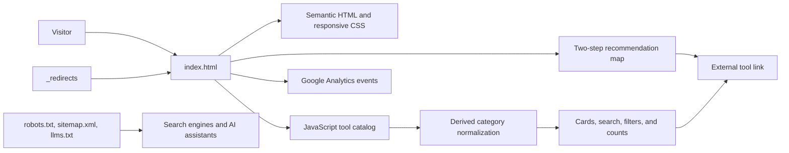

# Top PDF Edit Tools

A dependency-free, single-page directory for comparing 29 PDF tools by use case, privacy model, platform, and price.

## Overview

Top PDF Edit Tools turns a large, manually researched catalog into a searchable decision interface. I built the static site, its data-driven ranking cards, recommendation flow, comparison content, and discovery metadata so visitors can move from a broad list to a suitable tool without an account or application backend.

The directory also discloses that its first four entries are tools owned by the directory's creator. That relationship is shown in the page header, ranking cards, comparison table, methodology, and machine-readable summary rather than being hidden behind editorial language.

## Features

- Search across tool names, descriptions, taglines, and feature tags
- Filter by capability, price model, platform, and privacy approach
- Two-question tool picker with task- and privacy-aware recommendations
- Ranked cards for 29 tools plus an at-a-glance comparison table
- FAQ and four in-page editorial guides displayed in a keyboard-operable modal
- Responsive layout with a complete no-JavaScript ranking fallback

## Technical Highlights

- **Data-driven rendering:** A single JavaScript catalog holds ranking, pricing, platform, feature, and ownership data. Card markup and filter counts are generated from that source instead of duplicated by hand.
- **Derived classification:** A normalization pass adds splitter and converter categories from catalog text, allowing relevant multi-purpose tools to appear in filters without repeating those tags across every record.
- **Progressive enhancement:** The interactive catalog is paired with a static `<noscript>` list. Native `
` elements keep FAQs usable without custom controls, while semantic labels and live status text support keyboard and assistive-technology use.
- **Explicit recommendation state:** The picker separates task selection from privacy preference, then resolves that pair through a small recommendation map. This keeps the decision logic inspectable and independent from card rendering.
- **Static deployment design:** HTML, CSS, catalog data, and behavior ship in one document. There is no package manager, build pipeline, database, or application server; `_redirects` supplies canonical-host redirects and single-page fallback behavior for compatible static hosts.
- **Discovery and measurement:** The site includes canonical and social metadata, JSON-LD for `WebSite`, `ItemList`, `FAQPage`, and breadcrumbs, plus `robots.txt`, `sitemap.xml`, and an `llms.txt` summary. Google Analytics events cover outbound tool visits, searches, and filter use.

### Tradeoffs

Keeping the project in one HTML file makes deployment and local inspection simple, but couples content, presentation, and behavior in a large document. Catalog facts and some comparison facts also appear in separate HTML, JavaScript, JSON-LD, no-JavaScript, and LLM-facing representations; updates therefore require careful consistency checks. The repository currently has no automated validation for those copies or for browser behavior.

## Architecture

The browser loads `index.html` directly. Inline JavaScript normalizes the catalog and renders the interactive cards; user input updates in-memory state and re-renders the visible subset. The picker uses a separate lookup table, and all selected tools open on their external sites. No PDF files are processed by this repository.

## Tech Stack

- HTML5 and native accessibility elements
- CSS3 with responsive media queries and custom properties
- Vanilla JavaScript
- JSON-LD / Schema.org structured data
- Google Analytics 4
- Google Fonts
- Static-host redirect rules

## Getting Started

No dependencies, environment variables, package installation, or build step are defined.

1. Clone or download the repository.
2. Open `index.html` in a modern browser.

The core interface runs as a static document. An internet connection is needed for Google Fonts, analytics, and outbound tool links. Automated tests and test commands are not included in the repository.

## Demo

Live site: [toppdfedittools.com](https://toppdfedittools.com/)

## Project Status

**Active.** The directory is implemented and publicly accessible. Its dated rankings, pricing, and product claims require ongoing manual review; no planned feature work is documented in the repository.

## What I Learned

- A comparison interface benefits from one renderable catalog, but SEO and no-JavaScript support can reintroduce duplicated facts that need an explicit maintenance strategy.
- Ownership disclosure is an architectural concern as well as a writing concern: it should survive across interactive cards, static fallbacks, comparison views, and machine-readable content.
- Small client-side state machines can make a dense catalog approachable without adding a framework or backend.
- Static delivery reduces operational complexity, while shifting quality work toward content verification, accessibility, metadata consistency, and browser-level testing.
